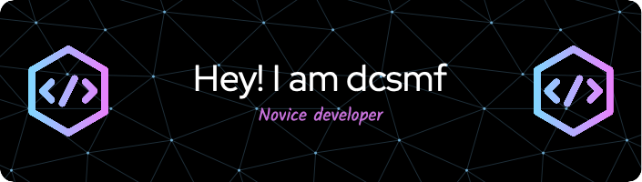

- 🔭 I’m currently working on **Java**
- 🌱 I’m currently learning languages are **Kotlin**, **Rust**
- 🌱 I’m currently learning libs are **SpringCloud**, ~~**SpringBoot**~~, ~~**Vue.js**~~

### Blog posts
<!-- BLOG-POST-LIST:START -->
- [Java中常用的Stream流操作](http://dcsmf.github.io/post/d861ab24/)
- [Java中的联合类型是怎么回事](http://dcsmf.github.io/post/729d788b/)
<!-- BLOG-POST-LIST:END -->

<!--
**dcsmf/dcsmf** is a ✨ _special_ ✨ repository because its `README.md` (this file) appears on your GitHub profile.

Here are some ideas to get you started:

- 🔭 I’m currently working on ...
- 🌱 I’m currently learning ...
- 👯 I’m looking to collaborate on ...
- 🤔 I’m looking for help with ...
- 💬 Ask me about ...
- 📫 How to reach me: ...
- 😄 Pronouns: ...
- ⚡ Fun fact: ...
-->
